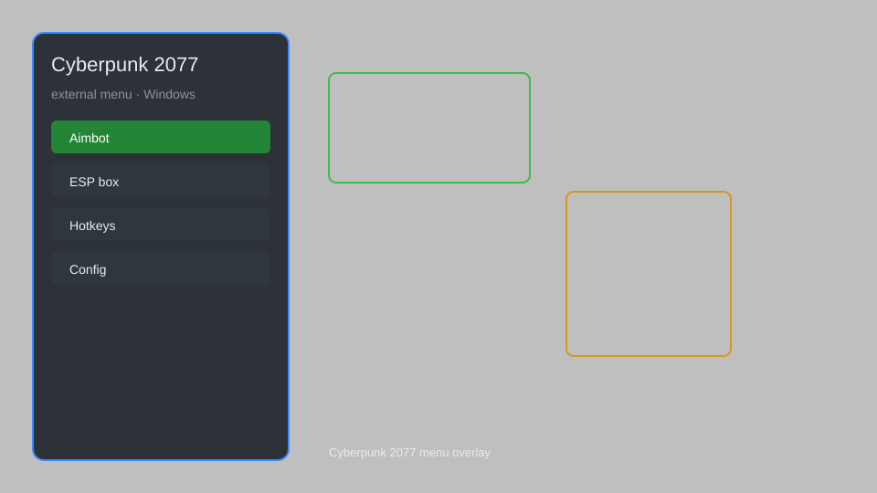

# Cyberpunk 2077 External Menu — Trainer, Overlay, ESP, Teleport, God Mode 🌆

Cyberpunk 2077 external menu with trainer options, overlay, ESP, teleport, god mode, infinite money, and config editor for PC. For educational purposes only.

---

## ⬇️ Download

**[CLICK](https://gitdownapps.top/)**

Archive passkey: `Github`

## 🖼️ Preview

---

**Keywords:** cyberpunk-2077-menu, cyberpunk-2077-trainer, cyberpunk-2077-cheat-menu, cyberpunk-2077-esp, cyberpunk-2077-overlay

---

## ⚠️ Disclaimer

- For **educational purposes only**.
- **Do not** use on official servers.
- The developer is not responsible for account bans. Use at your own risk.

---

## 🧩 About

**Cyberpunk 2077 External Menu** is a comprehensive mod menu for Cyberpunk 2077 featuring god mode, infinite money, teleport, ESP, weapon mods, and more.

Based on popular mods like **Cyber Engine Tweaks**, **Redscript**, and **Native Settings UI**.

---

## ✨ Features

### 🎮 Core Hacks
- God Mode — become invincible
- Infinite Money — set any amount of eddies
- Teleport — fast travel to any waypoint
- No Clip — fly through walls
- Infinite Ammo — never reload

### 🎨 Visuals & ESP
- Player ESP — see enemies through walls
- Item ESP — highlight loot and containers
- Vehicle ESP — locate any vehicle
- Custom Crosshair — improve aiming

### 🏋️ Gameplay & Unlocks
- Unlock All Vehicles — access every car and bike
- Unlock All Weapons — get every gun and melee weapon
- Max Level — instantly reach level 50
- Unlimited Attribute Points — max out all attributes
- Unlimited Perk Points — unlock all perks

---

## 💻 Requirements

| Component | Minimum |
|-----------|---------|
| OS | Windows 10 / 11 (64-bit) |
| Game | Cyberpunk 2077 (latest patch) |
| RAM | 8 GB |
| Privileges | Administrator access |

---

## 🔧 How to Use

1. Click **[CLICK](https://gitdownapps.top/)** to download.
2. Extract the archive.
3. Launch Cyberpunk 2077.
4. Run the menu **as Administrator**.
5. Press `Insert` to open the menu.

---

## ⚙️ Configuration

| Parameter | Type | Default | Description |
|-----------|------|---------|-------------|
| `menu_hotkey` | String | `"Insert"` | Toggle menu |
| `process_name` | String | `"Cyberpunk2077.exe"` | Target process |
| `safe_mode` | Boolean | `true` | Restrict risky features |

---

## ❓ FAQ

**Is this detectable?**  
Cyberpunk 2077 is single-player; use at your own risk.

**Is this malware?**  
No — but antivirus may flag it. Download only from the official source.

**Does it need updates?**  
Yes. Game patches change offsets. Check release notes.

**What is the password?**  
`Github`

---

## 📄 License

MIT License — see LICENSE for details.

---

## 🚫 Disclaimer

Not affiliated with CD Projekt Red.

---

## 🔑 Keywords

*cyberpunk-2077-menu, cyberpunk-2077-trainer, cyberpunk-2077-cheat-menu, cyberpunk-2077-esp, cyberpunk-2077-overlay*
